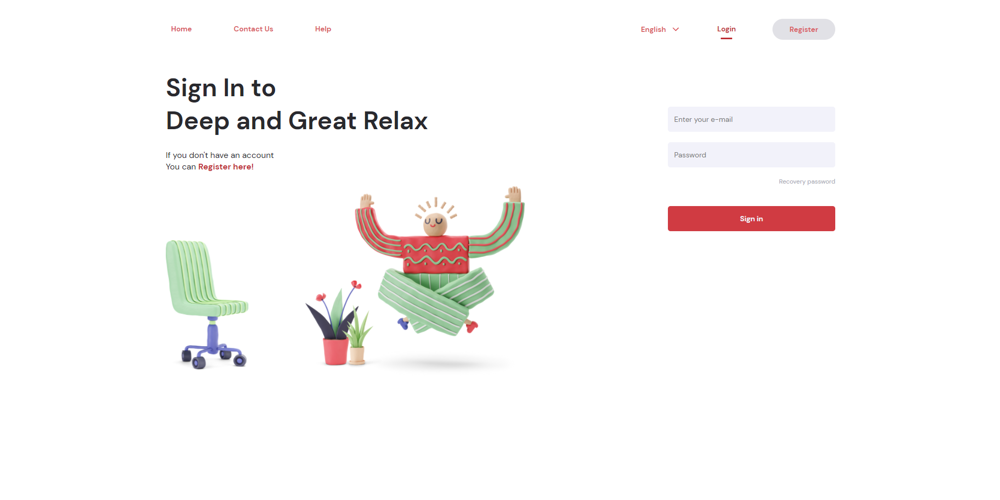

# Rlxr

<p align="center">
  
<p/>

## Overview

This project is about webapp about relax and meditation methods. Is a conceptual product to practice my skills ins ReactJS with Vite and CSS with Sass.

The UI war inspired [in this project](https://dribbble.com/shots/13774549-Recharge-Quickly) on Dribbble.

---

## Installation

- ```$git clone git@github.com:tarcizio-barbosa/rlxr.git```

- ```yarn```

- ```yarn dev```

---

## Contributions

I have serious difficulties with responsive design. Show me how you would.

---

## ToDos

**Navigation**

- [x] Add before element to show the current page "Login";
- [x] Create a "Register" button;


**Hero & Images**

- [x] Add hero and paragraph;
- [x] Add imagens;

**Form**

- [x] Create input component;
- [x] Create primary button component;
- [x] Finish the form;

